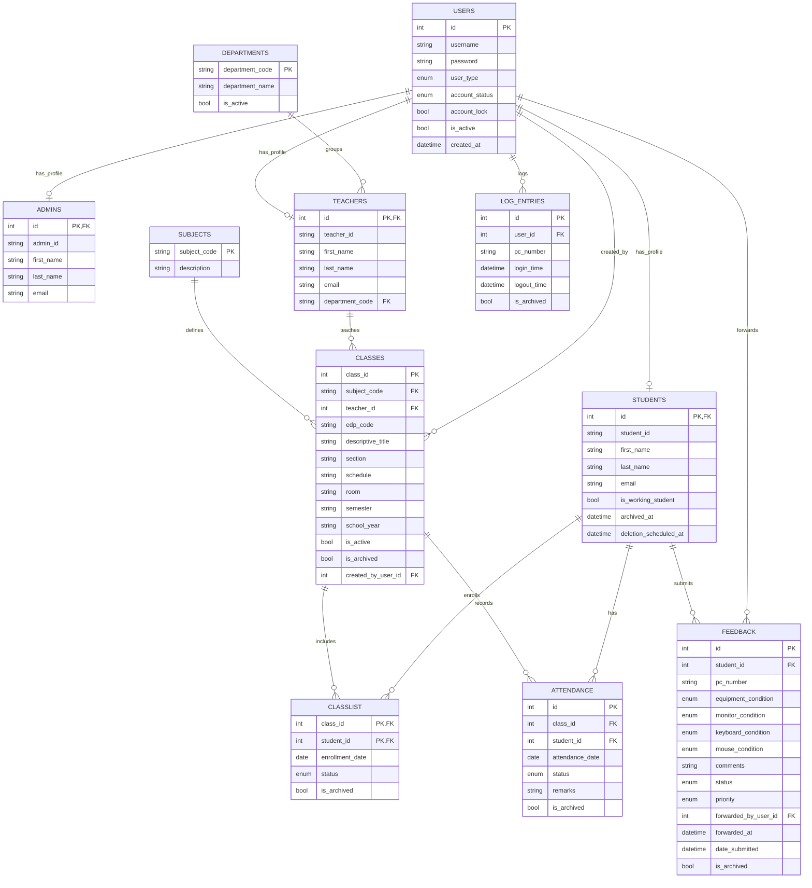

# Digital Logbook MVP ERD (Clean Version)

This ERD focuses on the **minimum core tables** needed for login, class enrollment, attendance, and feedback workflows.

## Core MVP Tables

1. `users` - authentication and role
2. `students` - student profile
3. `teachers` - teacher profile
4. `admins` - admin profile
5. `subjects` - subject master list
6. `classes` - class offerings
7. `classlist` - student-class enrollment
8. `attendance` - daily attendance per class
9. `log_entries` - login/logout sessions
10. `feedback` - lab equipment reports
11. `departments` - teacher grouping

## Optional / Secondary Module

- `profile_photos` (can be excluded from MVP if photo feature is not needed)
- `registration_approvals` (can be excluded from MVP if self-registration approval flow is not needed)

## Mermaid ERD

## Minimal ERD View (if you want very simple)

If your panel wants a very simple diagram, use only:

- `users`
- `students`
- `teachers`
- `classes`
- `classlist`
- `attendance`

Then add `feedback` and `log_entries` as separate feature modules.

## Revised Attendance Flow (Straight, Simple, Practical)

To address the "manual attendance" concern, use this operational flow:

1. Teacher creates class and enrolls students in `classlist`.
2. Student logs in to a lab PC (`log_entries` records login time and workstation).
3. System gets all active classlist enrollments of the student.
4. For each enrolled class, system auto-initializes today's attendance sheet (default `absent` for active enrolled students).
5. System immediately updates the logging-in student to `present` in `attendance`.
6. Teacher only reviews/adjusts edge cases (late, valid absences), not encode from scratch.

This makes attendance primarily **system-generated** and only secondarily **teacher-corrected**.

## Attendance Rules (Current System Behavior)

- **Trigger**: Attendance automation runs on student login.
- **Class scope**: Only active, non-archived classes where student enrollment is active.
- **Sheet generation**: If today's class sheet does not exist, system creates it automatically and sets all enrolled students to `absent` by default.
- **Auto-marking**: Logging-in student is upserted to `present` for today.
- **Edit control**: Teachers can edit only today's attendance; past dates are read-only.
- **Archive control**: Only past attendance can be archived.

## Recommendations (For IT Teachers and Panelists)

- Keep `attendance` as the official class record, and treat `log_entries` as objective evidence/audit trail.
- Continue same-day edit rule for teachers; lock past dates to protect data integrity.
- Keep default status as `absent`; promote to `present` automatically on student login for active classlist enrollments.
- Add a small grace window policy (e.g., first 10 minutes = `present`, after = `late`) and document it in system policy.
- Show "Auto-recorded by login" indicator in UI for transparency during checking.
- Include exception workflow: students without login evidence require teacher remark (`remarks`) before status change.
- If needed by policy, introduce teacher validation rules for late/excused cases while keeping classlist-based auto-generation.
- For defense/demo, prepare one scenario: student logs in -> attendance row appears automatically -> teacher only verifies.

## Suggested Defense Line

"Our attendance is not encoded manually. The system auto-generates attendance from active classlists and auto-updates records from authenticated lab logins, while teachers only validate exceptions for academic control."
