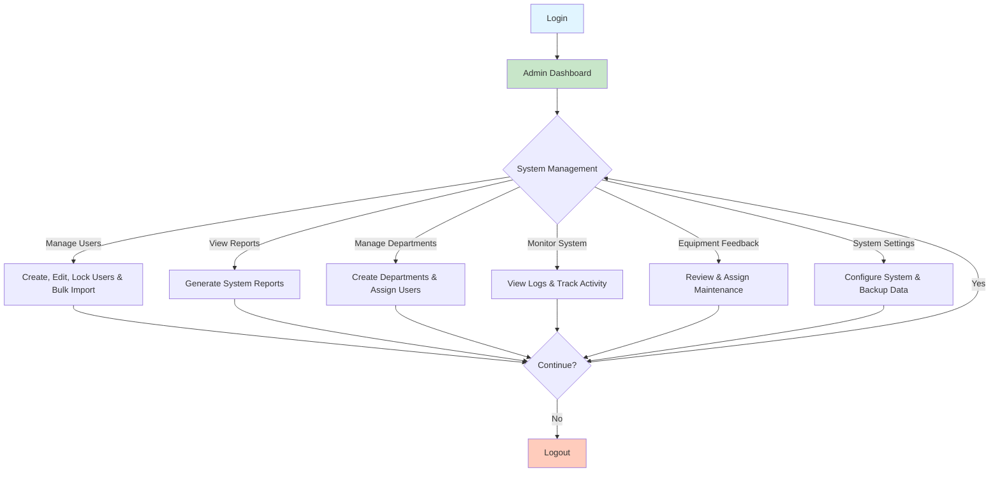

# Admin Workflow Diagram

## Admin Can:
- Manage all users (create, edit, delete, lock/unlock)
- Bulk import users via CSV
- Generate system reports (attendance, feedback, login logs)
- Create and manage departments
- Monitor all system activity and login logs
- Review and assign equipment maintenance tasks
- Configure system settings and backup data
