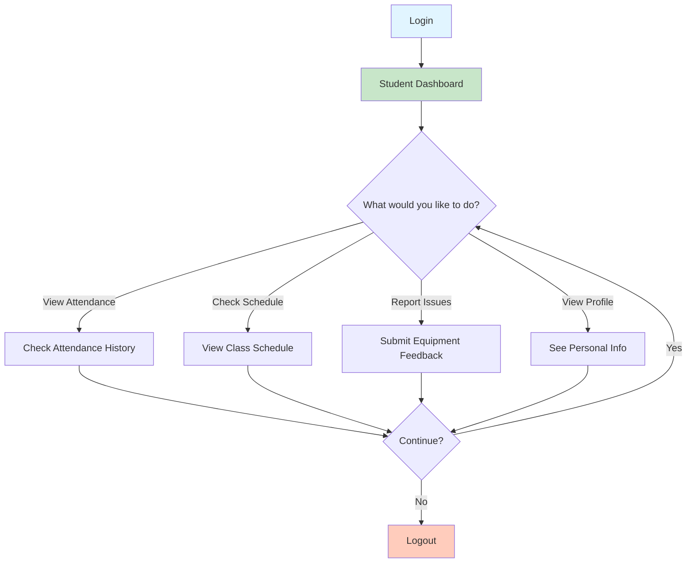

# Student Workflow Diagram

## Student Can:
- View attendance history and participation records
- Check class schedules and upcoming sessions
- Submit equipment feedback for lab issues
- Access personal profile information
