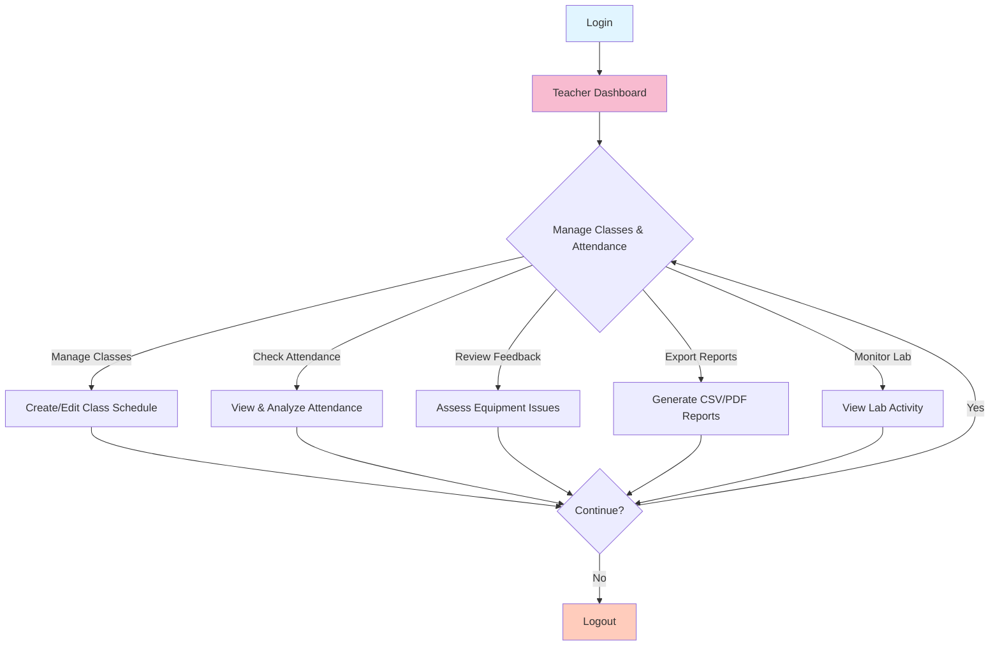

# Teacher Workflow Diagram

## Teacher Can:
- Create and manage class schedules
- View and analyze student attendance patterns
- Review and escalate equipment feedback
- Export attendance reports (CSV/PDF)
- Monitor lab activities and equipment status
- Manage class rosters
