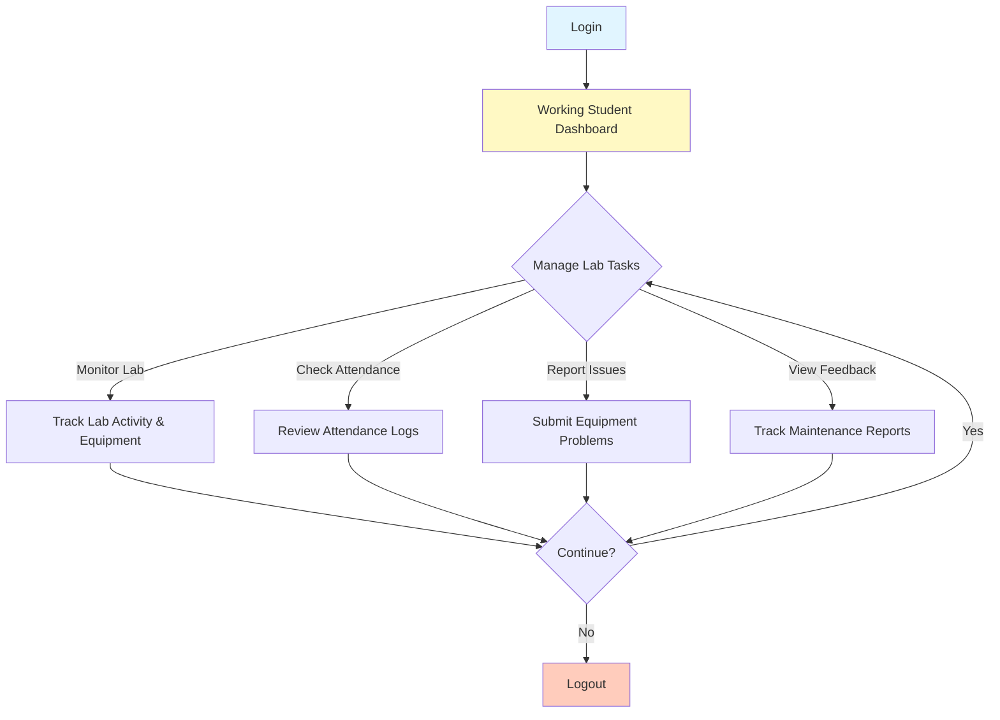

# Working Student Workflow Diagram

## Working Student Can:
- Monitor lab activity and track students in real-time
- Review attendance logs and records
- Report equipment malfunctions and issues
- Track maintenance report status
- Oversee lab operations and compliance
